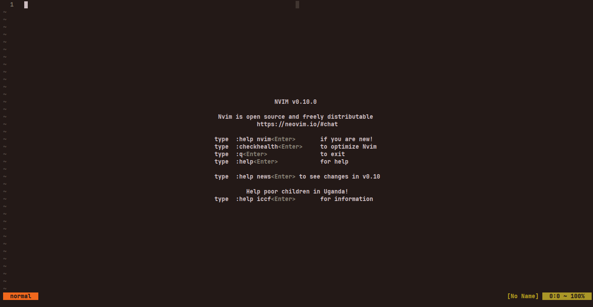
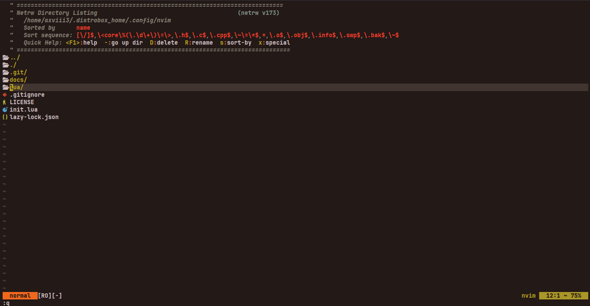
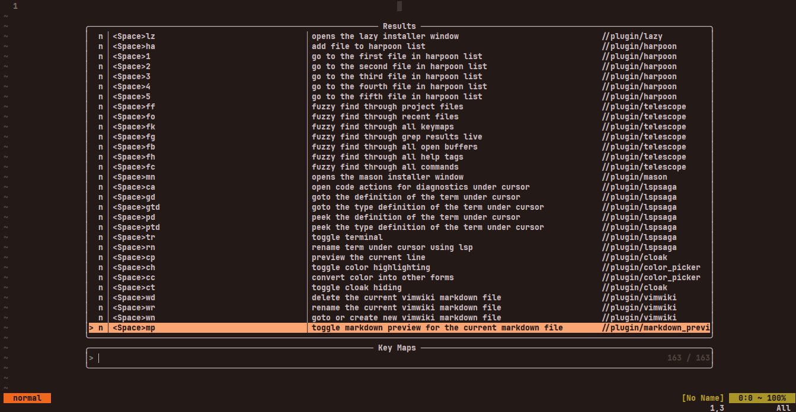
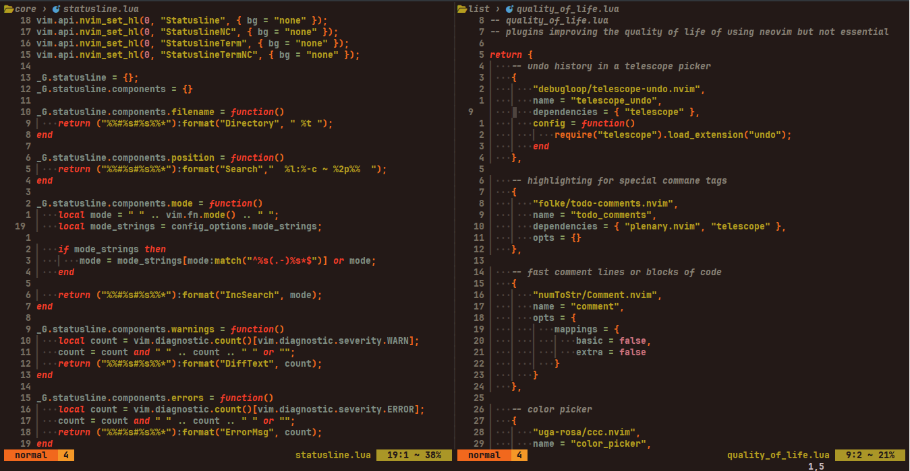

# Personalised Neovim Configuration

### TL;DR
Neovim configration with a minimal configuration with a relatievely low 
amount of plugins heavily personalised to my use cases.

### Installation
Download and move, or clone this repository to neovim's config location.  
Use `:h config` to find this location for your system.

### Setup
Default configuration are generally sensible for most people and should not 
cause errors in other systems. However, some settings are seperated from the 
config for fine tuning.

* Create `custom_config_options.lua` file in the `<config dir>/lua/`
* Copy the contents of `<config dir>/lua/default_config_options.lua`
* Paste in the newly created file and tune as needed

My [custom options](./my_custom_options.md)

### Features
* Personalised to me (might not be a feature for everyone xD)
* Relatievely low number plugins (27 as of 2-July-24)
* Very flexible and modular configuration
* Easily searchable keymaps
    > By pressing "\<space\>fk" you can open the telescope picker listing 
    all avalilable keymaps. Searching `//plugin` will bring up all plugin 
    related keymaps. Searching `//plugin/<plugin name>` will bring up all 
    keymaps related to a plugin. You can also search `//core` for non plugin 
    custom keymaps
* Easily searchable commands
    > If you have set the `custom_command_prefix` in the config options to 
    something other than "", then all commands will be prefixed with that 
    string in uppercase making it easier to search.  
    `NOTE`: This option defaults to a empty string and you need to set this 
    option manually
* Sensible keymaps generally in format `<plugin char><action char>` with 
some exceptions. Plugin char is the first character of the plugin name and 
action char is the first character of the action's name or something 
sensible.

### Code Docs
The configuration is divided into two parts
* Core neovim configuration
* Plugin configuration

The plugin configurations can be disabled via custom config options.

[Detailed code docs](./code_docs.md)

### Screenshots
#### Last updated 2-July-24

